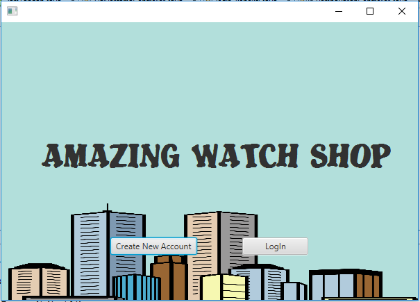
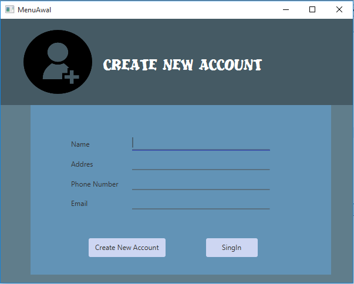
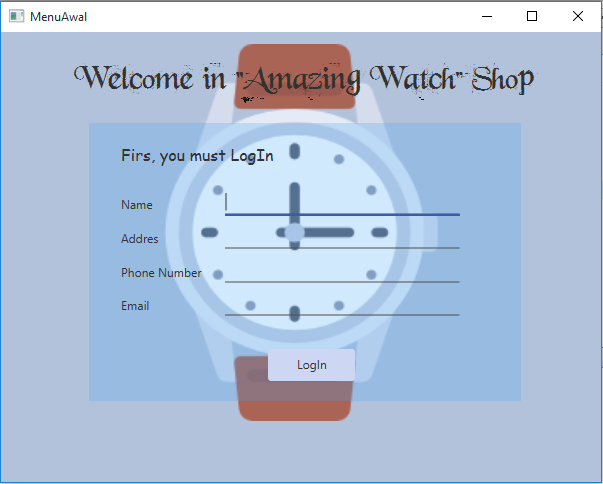
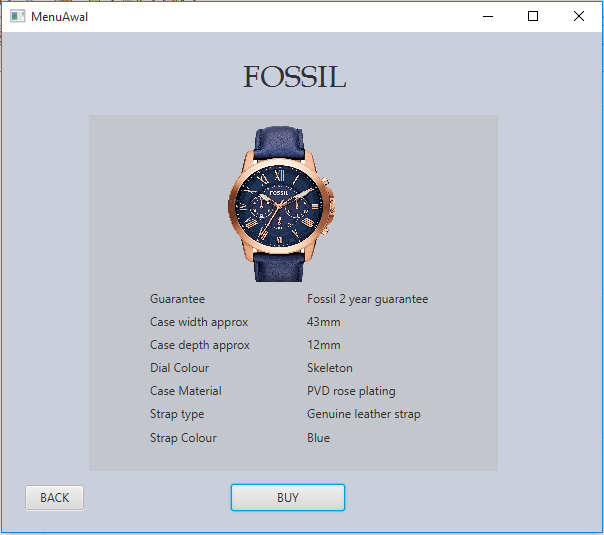
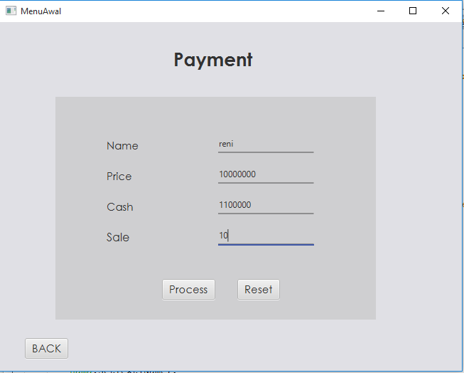
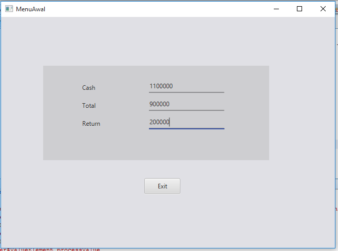

# Tugas_akhir_PBO
## ini adalah tampilan halaman pertama saat program dijalankan

## ini adalah tampilan saat user tidak memiliki akun untuk login maka, memilih create new account

## ini adalah tampilan halaman saat user telah membuat account baru, dan bisa juga waktu dihalaman awal user sudah memiliki account dan memilih login

## ini adalah tampilan halaman ketika user sudah membuat account dan telah login, dihalaman ini user bisa memilih jam tangan sesuai seleranya

## ini adalah tampilan halaman saat user ingin melihat lebih jauh tentang jam tersebut, dan melihat spesifikasinya

## ini adalah tampilan halaman saat user ingin membeli barang tersebut. disini menginput nama, harga, jumlah uang yg akan dibayar, dan diskon

## ini adalah tampilan halaman setelah menginput data pembelian, dan disini menampilkan uang yg dibayar, total dan kembalian

#
